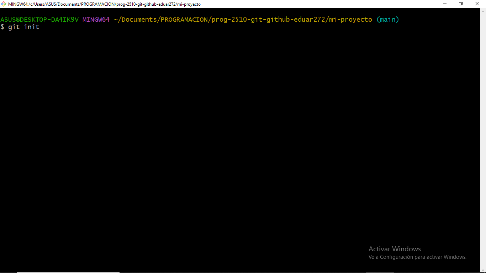
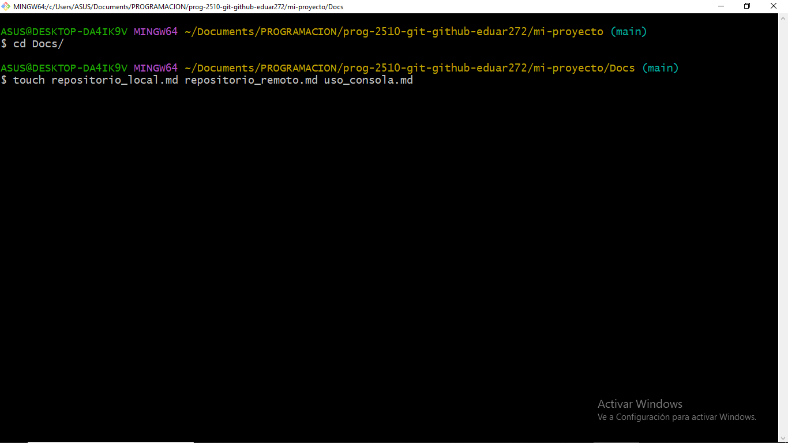

#Repositorio local

Para crear un repositorio local con Git, primero asegúrate de tener Git instalado en tu sistema. Luego, abre una terminal y navega a la carpeta donde deseas crear tu proyecto. 

Usa el comando git init para inicializar un nuevo repositorio, lo que creará una carpeta oculta .git en tu directorio.

A continuación, añade archivos al repositorio creándolos o copiándolos en la carpeta y usa git add <archivo> para agregarlos al área de preparación (staging).

Cuando estés listo, guarda los cambios con un commit usando git commit -m "mensaje descriptivo". Puedes ver el historial de commits con git log. Si deseas ignorar ciertos archivos, crea un archivo .gitignore y lista los patrones o nombres de archivos que no quieres rastrear. Con estos pasos, habrás creado y configurado un repositorio Git local para gestionar el control de versiones de tu proyecto.Debes tener todos los commmits en linea hechos

